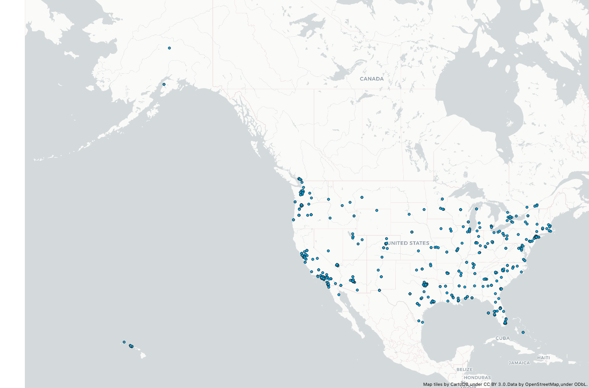
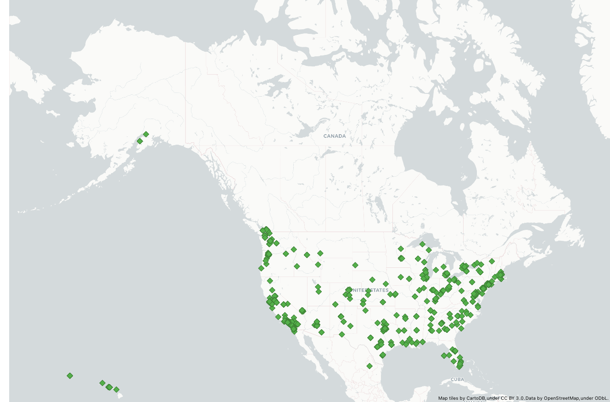
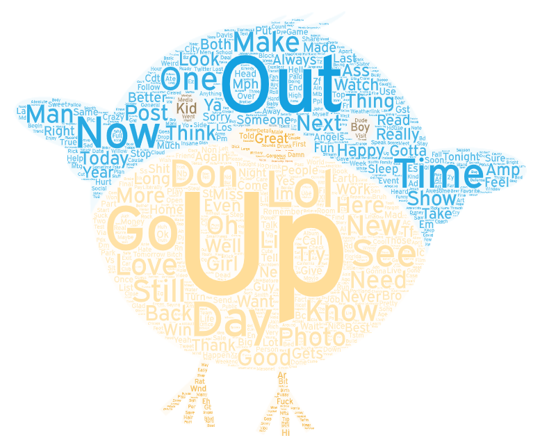
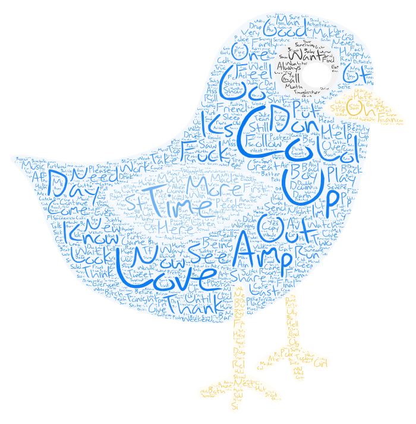

# Lab2

## Comparing Tweets in the United States from two night times (10:30pm and 11:15pm)

For my comparison I decided to map tweets in the United States betweem two times. A couple of things that I noticed when making these two maps was the general amount of tweets. It seems as the night progressed there were more tweets total at the later time than the earlier time. I also found the tweets in Alaska to be interesting because its such a low populated place that you can tell the difference in where people are tweeting from very easily. Overall there is not a huge change between the two, however if you look long enough you can spot some minor differences between the amounts of tweets and where they are coming from. (Both Maps Below)

#### Map 1 (US 10:30pm)

#### Map 2 (US 11:10pm)

## Comparing Tweet Word Maps from two night times (10:30pm and 11:15pm)

For my two word maps I decided to use two birds as the shapes to tie in the idea that these words came from twitter. I filtered out all the words that had special characters or unreadable words. Some of the comparisons you can see is that "up" is a popular word used in tweets at both times. It is a bit hard to tell what the full tweets would say however it is still interesting to view the most popular words in the tweets. 

#### Word Map 1 (US 10:30pm)

### Word Map 2 (US 11:10pm)

